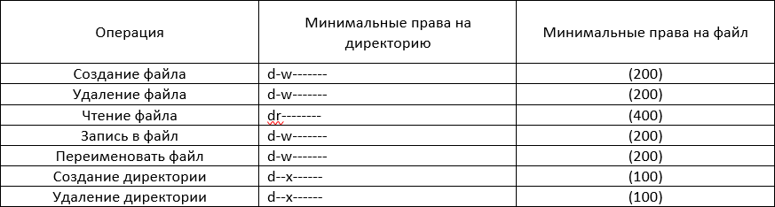

---
## Front matter
lang: ru-RU
title: "Лабораторная работа №2: Презентация."
subtitle: 
  Дискреционное разграничение прав в Linux. Основные атрибуты.
author: 
    Евдокимов Максим Михайлович. Группа - НФИбд-01-20.\inst{1}
institute: 
    \inst{1}Российский Университет Дружбы Народов

date: 8 сентября, 2023, Москва, Россия

## i18n babel
babel-lang: russian
babel-otherlangs: english

## Formatting pdf
toc: false
toc-title: Содержание
slide_level: 2
aspectratio: 169
section-titles: true
theme: metropolis
header-includes:
 - \metroset{progressbar=frametitle,sectionpage=progressbar,numbering=fraction}
 - '\makeatletter'
 - '\beamer@ignorenonframefalse'
 - '\makeatother'
---

# Цели и задачи работы

## Цель лабораторной работы

Получение практических навыков работы в консоли с атрибутами файлов, закрепление теоретических основ дискреционного разграничения доступа в современных системах с открытым кодом на базе ОС Linux.

## Задание

1. Создание и вход в систему с нового пользователя.
2. Анализ данных о созданном пользователе.
3. Изучить возможности и уровень доступа нового пользователя.
4. Основываясь на полученных данных создать 2 таблицы "Установленные права и разрешённые действия" и "минимальной необходимые права для выполнения операций".

# Выполнение лабораторной работы

## Пункт 1, 2

Используя права администратора с помощью команды "useradd" создаём пользователя guest и "passwd" задаём ему пороль.

{#fig:001 width=70% height=70%}

## Пункт 3, 4

Воспользовавшись командой "su guest" и введя выше созданный пароль заходим в терминал от лица нового пользователя. Использовав команду "pwd" определяем что мы находимся в домашней директории.

{#fig:002 width=70% height=70%}

## Пункт 5, 6

Уточняем имя пользователя командой "whoami" и уточните имя вашего пользователя, его группу, а также группы, куда входит пользователь, командой "id".

{#fig:003 width=70% height=70%}

## Пункт 7, 8

Сравнив полученную данные от двух команд и информации которая у нас есть просмотрите файл /etc/passwd командой "cat".

{#fig:004 width=70% height=70%}

---

Находим в полученный списке свою учётную запись, и определяем uid пользователя и gid пользователя. Сравним найденные значения с полученными в предыдущих пунктах.

{#fig:005 width=70% height=70%}

## Пункт 9, 10

Определяем существующие в системе директории командой "ls -l /home/".

{#fig:006 width=70% height=70%}

---

Проверяем какие расширенные атрибуты установлены на поддиректориях, командой "lsattr /home".

{#fig:007 width=70% height=70%}

## Пункт 11, 12

Создаём в домашней директории поддиректорию dir1 командой "mkdir dir1" и определяем командами "ls -l" и "lsattr", какие права доступа и расширенные атрибуты у него есть.

{#fig:008 width=70% height=70%}

---

Теперь снимем с директории dir1 все атрибуты командой "chmod 000 dir1", и командой "ls -l" проверим с её помощью правильность выполнения.

{#fig:009 width=70% height=70%}

## Пункт 13

Пробуем создать в директории dir1 файл file1 командой "echo "test" > /home/guest/dir1/file1".

{#fig:010 width=70% height=70%}

# Таблицы

## 14.Установленные права и разрешённые действия

{#fig:011 width=70% height=70%}

## 15.Минимальной необходимые права для выполнения операций

{#fig:012 width=70% height=70%}

# Выводы по проделанной работе

## Вывод

В ходе выполнения лабораторной работы были расмотрены разные уровни доспупа в системах Linux, а также изучена работа с пользователями и их созданием.
