---
## Front matter
lang: ru-RU
title: "Лабораторная работа №2: отчет."
subtitle: "Дискреционноеразграничение прав в Linux. Основные атрибуты."
author: "Евдокимов Максим Михайлович. Группа - НФИбд-01-20."

## Generic otions
lang: ru-RU
toc-title: "Содержание"

## Bibliography
bibliography: bib/cite.bib
csl: pandoc/csl/gost-r-7-0-5-2008-numeric.csl

## Pdf output format
toc: true # Table of contents
toc-depth: 2
lof: true # List of figures
fontsize: 12pt
linestretch: 1.5
papersize: a4
documentclass: scrreprt
## I18n polyglossia
polyglossia-lang:
  name: russian
  options:
	- spelling=modern
	- babelshorthands=true
polyglossia-otherlangs:
  name: english
## I18n babel
babel-lang: russian
babel-otherlangs: english
## Fonts
mainfont: PT Serif
romanfont: PT Serif
sansfont: PT Sans
monofont: PT Mono
mainfontoptions: Ligatures=TeX
romanfontoptions: Ligatures=TeX
sansfontoptions: Ligatures=TeX,Scale=MatchLowercase
monofontoptions: Scale=MatchLowercase,Scale=0.9
## Biblatex
biblatex: true
biblio-style: "gost-numeric"
biblatexoptions:
  - parentracker=true
  - backend=biber
  - hyperref=auto
  - language=auto
  - autolang=other*
  - citestyle=gost-numeric
## Pandoc-crossref LaTeX customization
figureTitle: "Рис."
listingTitle: "Листинг"
lofTitle: "Список иллюстраций"
lotTitle: "Список таблиц"
lolTitle: "Листинги"
## Misc options
indent: true
header-includes:
  - \usepackage{indentfirst}
  - \usepackage{float} # keep figures where there are in the text
  - \floatplacement{figure}{H} # keep figures where there are in the text
---

# Цель работы

Получение практических навыков работы в консоли с атрибутами файлов, закрепление теоретических основ дискреционного разграничения доступа в современных системах с открытым кодом на базе ОС Linux.

# Задание

1. Создание и вход в систему с нового пользователя.
2. Анализ данных о созданном пользователе.
3. Изучить возможности и уровень доступа нового пользователя.
4. Основываясь на полученных данных создать 2 таблицы "Установленные права и разрешённые действия" и "минимальной необходимые права для выполнения операций".

# Выполнение лабораторной работы

## Пункт 1, 2

Используя права администратора с помощью команды "useradd" создаём пользователя guest и "passwd" задаём ему пороль.

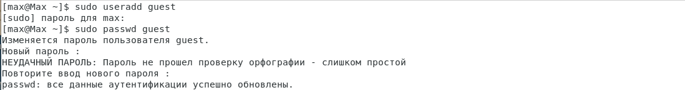{#fig:001 width=70% height=70%}

## Пункт 3, 4

Воспользовавшись командой "su guest" и введя выше созданный пароль заходим в терминал от лица нового пользователя. Использовав команду "pwd" определяем что мы находимся в домашней директории.

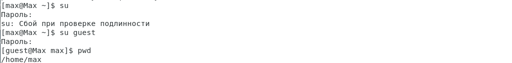{#fig:002 width=70% height=70%}

## Пункт 5, 6

Уточняем имя пользователя командой "whoami" и уточните имя вашего пользователя, его группу, а также группы, куда входит пользователь, командой "id".

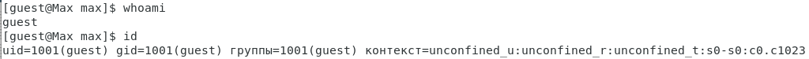{#fig:003 width=70% height=70%}

## Пункт 7, 8

Сравнив полученную данные от двух команд и информации которая у нас есть просмотрите файл /etc/passwd командой "cat".

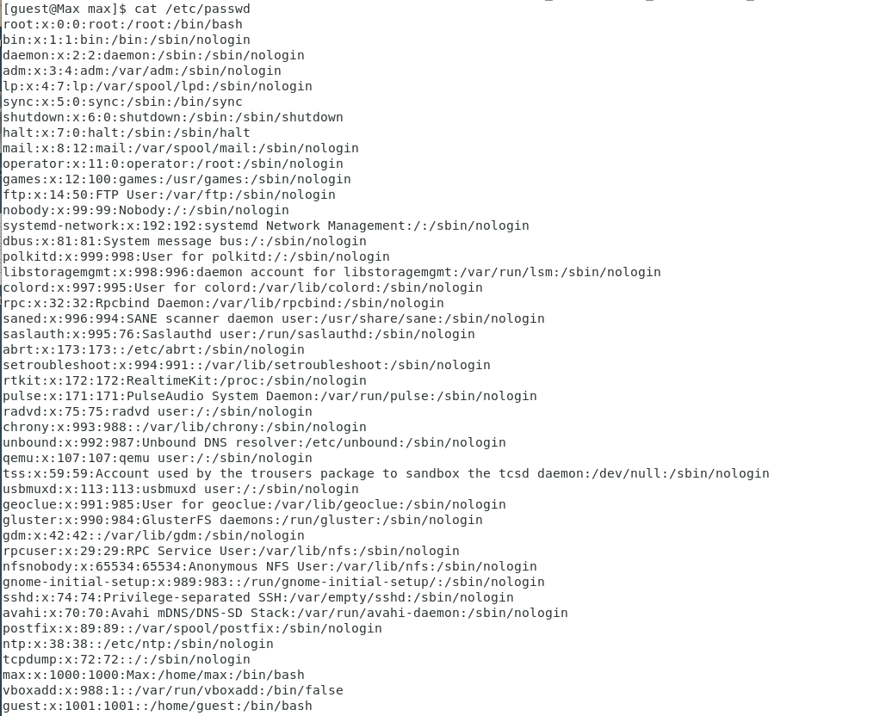{#fig:004 width=70% height=70%}

Находим в полученный списке свою учётную запись, и определяем uid пользователя и gid пользователя. Сравним найденные значения с полученными в предыдущих пунктах.

{#fig:005 width=70% height=70%}

## Пункт 9, 10

Определяем существующие в системе директории командой "ls -l /home/".

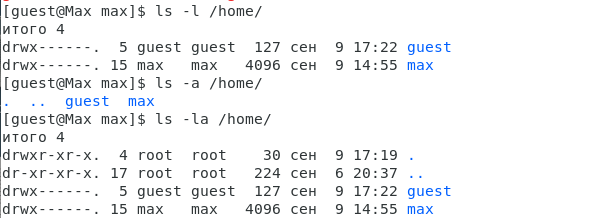{#fig:006 width=70% height=70%}

Проверяем какие расширенные атрибуты установлены на поддиректориях, командой "lsattr /home".

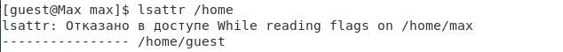{#fig:007 width=70% height=70%}

## Пункт 11, 12

Создаём в домашней директории поддиректорию dir1 командой "mkdir dir1" и определяем командами "ls -l" и "lsattr", какие права доступа и расширенные атрибуты у него есть.

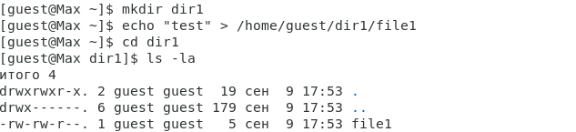{#fig:008 width=70% height=70%}

Теперь снимем с директории dir1 все атрибуты командой "chmod 000 dir1", и командой "ls -l" проверим с её помощью правильность выполнения.

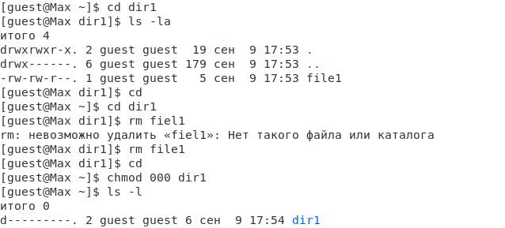{#fig:009 width=70% height=70%}

## Пункт 13

Пробуем создать в директории dir1 файл file1 командой "echo "test" > /home/guest/dir1/file1".

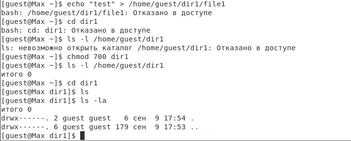{#fig:010 width=70% height=70%}

# Таблицы

## 14.Установленные права и разрешённые действия

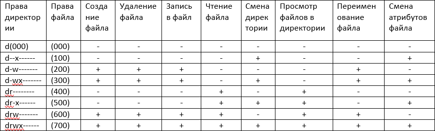{#fig:011 width=70% height=70%}

## 15.Минимальной необходимые права для выполнения операций

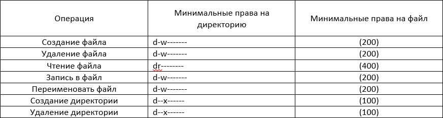{#fig:012 width=70% height=70%}

# Выводы

В ходе выполнения лабораторной работы были расмотрены разные уровни доспупа в системах Linux, а также изучена работа с пользователями и их созданием.

# Список литературы {.unnumbered}

1. [Основные команды для работы с Linux](https://eternalhost.net/blog/sozdanie-saytov/osnovnye-komandy-linux)
2. [Основы управления пользоателем и командой su](https://losst.pro/komanda-su-v-linux)
3. [Файл лабораторной работы](https://esystem.rudn.ru/pluginfile.php/2090273/mod_resource/content/6/002-lab_discret_attr.pdf)
