---
## Front matter
lang: ru-RU
title: "Лабораторная работа №3: Презентация."
subtitle: 
  Дискреционное разграничение прав в Linux. Два пользователя.
author: 
    Евдокимов Максим Михайлович. Группа - НФИбд-01-20.\inst{1}
institute: 
    \inst{1}Российский Университет Дружбы Народов

date: 11 сентября, 2023, Москва, Россия

## i18n babel
babel-lang: russian
babel-otherlangs: english

## Formatting pdf
toc: false
toc-title: Содержание
slide_level: 2
aspectratio: 169
section-titles: true
theme: metropolis
header-includes:
 - \metroset{progressbar=frametitle,sectionpage=progressbar,numbering=fraction}
 - '\makeatletter'
 - '\beamer@ignorenonframefalse'
 - '\makeatother'
---

# Цели и задачи работы

## Цель лабораторной работы

Получение практических навыков работы в консоли с атрибутами файлов для групп пользователей.

## Задание

1. Создать нового пользователя и сравнить его параметры с пользователем из второй лабораторной.
2. Создать группы для пользователей guest и guest2, где guest будет главным.
3. Провести анализ уровней доступа в группе и на основе этих данных создать 2 новые таблицы подобные из второй лабораторной.

# Процесс выполнения лабораторной работы

# Выполнение лабораторной работы

## Пункт 1, 2

В установленной операционной системе проверяем учётную запись пользователя guest (использую учётную запись администратора) "sudo useradd guest", убеждаемся что, и Задайте пароль для пользователя guest (использую учётную запись администратора) "sudo passwd guest".

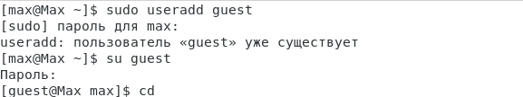{#fig:001 width=70% height=70%}

## Пункт 3, 4

Аналогично создаём второго пользователя guest2 "sudo useradd guest2" и "sudo passwd guest2" и добавляем пользователя guest2 в группу guest командой "gpasswd -a guest2 guest".

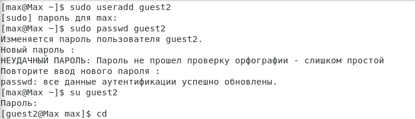{#fig:002 width=70% height=70%}

---

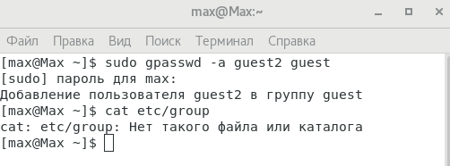{#fig:003 width=70% height=70%}

## Пункт 5, 6

Осуществите вход в систему от двух пользователей на двух разных консолях: guest на первой консоли и guest2 на второй консоли. Также для обоих пользователей командой "pwd" определяем директорию, в которой вы находитесь, сравнив её с приглашениями командной строки.

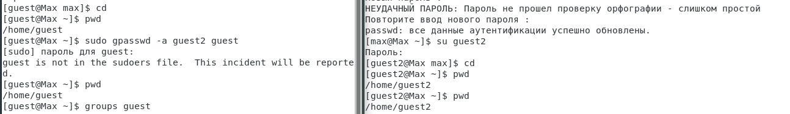{#fig:004 width=70% height=70%}

## Пункт 7, 8

Уточним имя вашего пользователя, его группу, кто входит в неё и к каким группам принадлежит он сам, для этого используем команду "groups guest" и "groups guest2". Сравните вывод команды "groups" с выводом команд "id -Gn" и "id -G", для каждого пользователя.

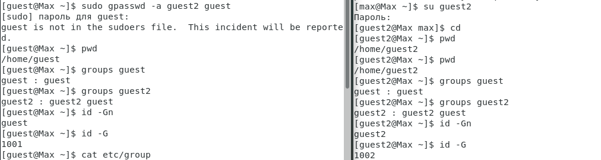{#fig:005 width=70% height=70%}

Сравните полученную информацию с содержимым файла "/etc/group" командой "cat /etc/group" от имени администратора (max).

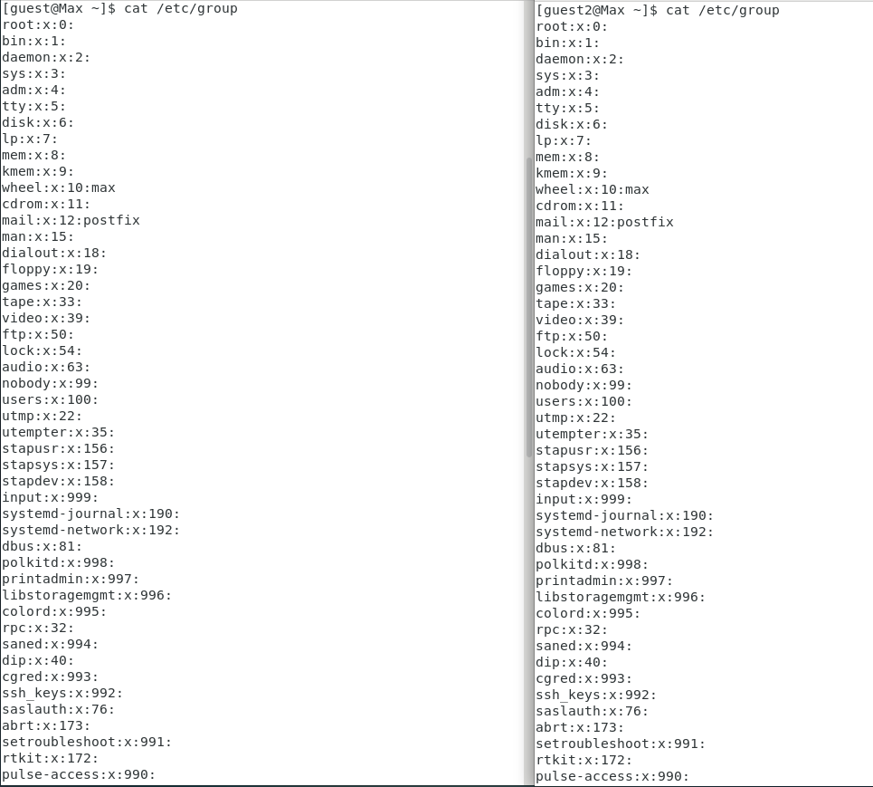{#fig:006 width=70% height=70%}

---

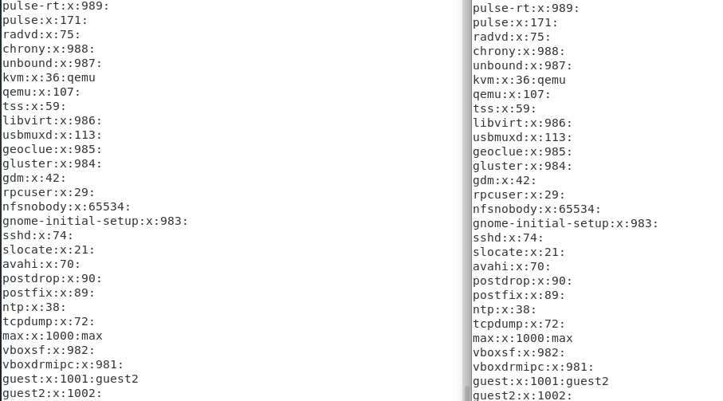{#fig:007 width=70% height=70%}

## Пункт 9, 10

От имени пользователя guest2 выполняем регистрацию пользователя guest2 в группе guest командой "newgrp guest". От имени пользователя guest изменим права директории "/home/guest", разрешив все действия для пользователей группы: "chmod g+rwx /home/guest".

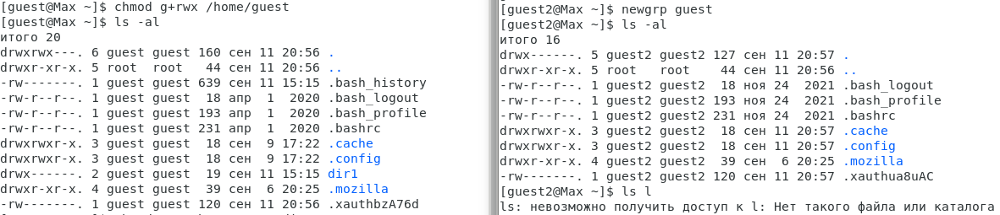{#fig:008 width=70% height=70%}

## Пункт 11

От имени пользователя guest снимите с директории "/home/guest/dir1" все атрибуты командой "chmod 000 dirl". И проведём анализ и изменяя уровень доступа директории и файла "file1" в нём на основные операции для пользователя группы guest2.

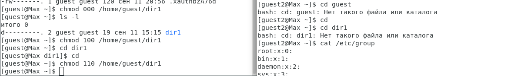{#fig:009 width=70% height=70%}

---

Проверяем как работает доступ на группе сделав простую проверку.

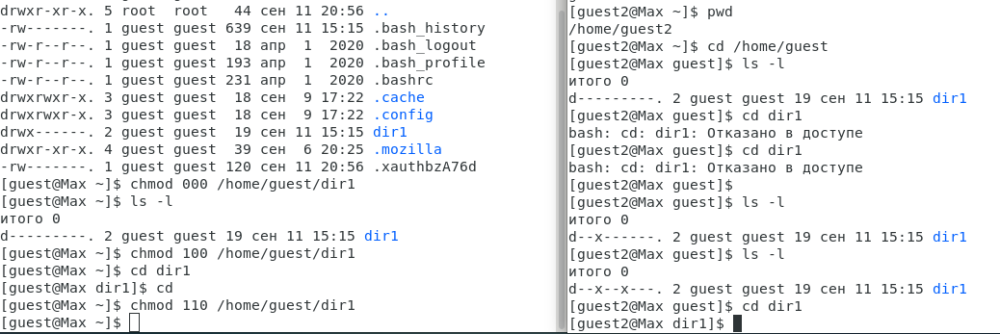{#fig:010 width=70% height=70%}

# Таблицы

## 11.1 Установленные права и разрешённые действия 2

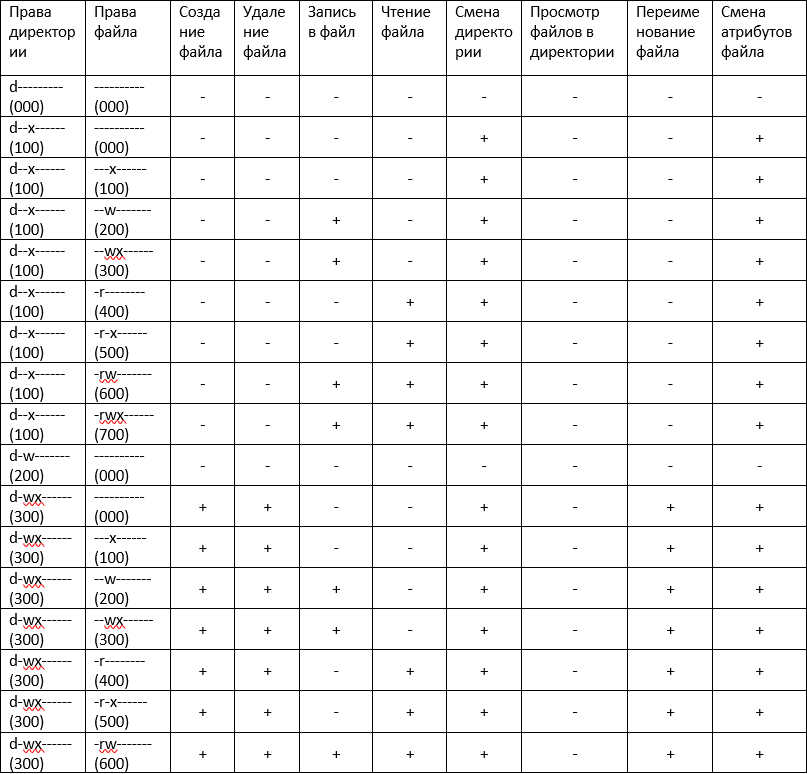{#fig:011 width=70% height=70%}

---

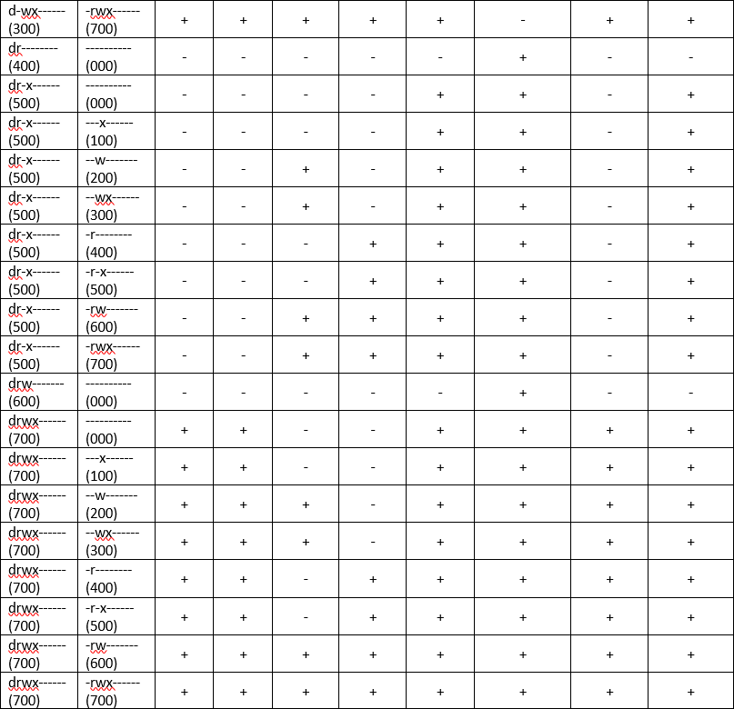{#fig:012 width=70% height=70%}

## 11.2 Минимальной необходимые права для выполнения операций 2

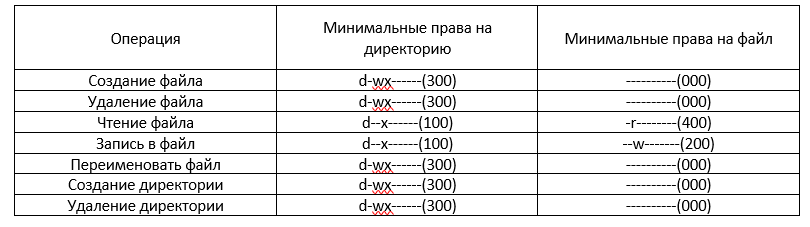{#fig:013 width=70% height=70%}

# Выводы по проделанной работе

## Вывод

В ходе выполнения лабораторной работы были получены основные знания и навыки по работе с группами и несколькими пользователями.
