---
## Front matter
lang: ru-RU
title: "Лабораторная работа №1: отчет."
subtitle: "Установка и конфигурацияоперационной системы на виртуальную машину."
author: "Евдокимов Максим Михайлович. Группа - НФИбд-01-20."

## Generic otions
lang: ru-RU
toc-title: "Содержание"

## Bibliography
bibliography: bib/cite.bib
csl: pandoc/csl/gost-r-7-0-5-2008-numeric.csl

## Pdf output format
toc: true # Table of contents
toc-depth: 2
lof: true # List of figures
fontsize: 12pt
linestretch: 1.5
papersize: a4
documentclass: scrreprt
## I18n polyglossia
polyglossia-lang:
  name: russian
  options:
	- spelling=modern
	- babelshorthands=true
polyglossia-otherlangs:
  name: english
## I18n babel
babel-lang: russian
babel-otherlangs: english
## Fonts
mainfont: PT Serif
romanfont: PT Serif
sansfont: PT Sans
monofont: PT Mono
mainfontoptions: Ligatures=TeX
romanfontoptions: Ligatures=TeX
sansfontoptions: Ligatures=TeX,Scale=MatchLowercase
monofontoptions: Scale=MatchLowercase,Scale=0.9
## Biblatex
biblatex: true
biblio-style: "gost-numeric"
biblatexoptions:
  - parentracker=true
  - backend=biber
  - hyperref=auto
  - language=auto
  - autolang=other*
  - citestyle=gost-numeric
## Pandoc-crossref LaTeX customization
figureTitle: "Рис."
listingTitle: "Листинг"
lofTitle: "Список иллюстраций"
lotTitle: "Список таблиц"
lolTitle: "Листинги"
## Misc options
indent: true
header-includes:
  - \usepackage{indentfirst}
  - \usepackage{float} # keep figures where there are in the text
  - \floatplacement{figure}{H} # keep figures where there are in the text
---

# Цель работы

Получение практических навыков работы в консоли с расширенными атрибутами файлов.

# Задание

1. Ознакомится и опробовать расширенные атрибуты "a" и "i" использовав разные команды от лица guest.
2. Проанализировать получаемые ответы от кансоли на разные команды.

# Выполнение лабораторной работы

## Пункт 1

От имени пользователя guest определяем расширенные атрибуты файла "lsattr /home/guest/dir1/file1".

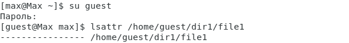{#fig:001 width=80% height=80%}

## Пункт 2

Установим командой "chmod 600 file1" на наш файл (file1) права, разрешающие чтение и запись для владельца файла.

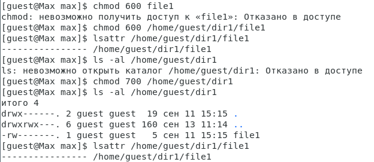{#fig:002 width=80% height=80%}

## Пункт 3

Попробуем установить на наш файл расширенный атрибут "a" от имени пользователя guest:
"chattr +a /home/guest/dir1/file1". В ответ получаем отказ.

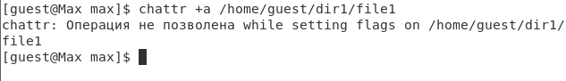{#fig:003 width=80% height=80%}

## Пункт 4

Зайдём в другую консоль с правами администратора, либо повысьте свои права с помощью команды su. Попробуйте установить расширенный атрибут "a" на наш файл от имени суперпользователя командой "chattr +a /home/guest/dir1/file1".

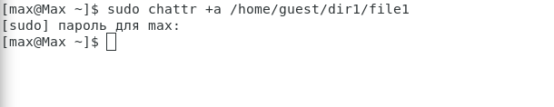{#fig:004 width=80% height=80%}

## Пункт 5

От пользователя guest проверим правильность установления атрибута командой "lsattr /home/guest/dir1/file1".

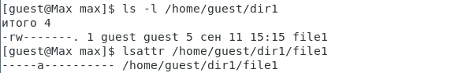{#fig:005 width=80% height=80%}

## Пункт 6

Попробуем выполнить дозапись в файл file1 слова «test» командой "echo "test" /home/guest/dir1/file1", и после этого выполним чтение файла file1 командой "cat /home/guest/dir1/file1"

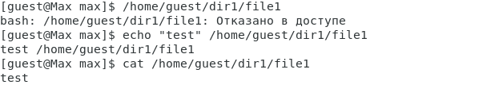{#fig:006 width=80% height=80%}

## Пункт 7

Попробуем удалить файл file1 либо стереть имеющуюся в нём информацию командой "echo "abcd" > /home/guest/dirl/file1". Попробуем переименовать файл командой "mv /home/guest/dirl/file1".

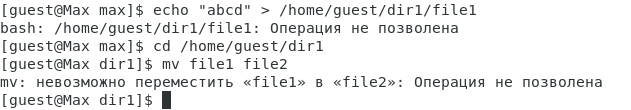{#fig:007 width=80% height=80%}

## Пункт 8

Попробуем с помощью команды "chmod 000 file1", установить на файл file1 права запрещающие чтение и запись для владельца файла, и так как атрибут "a" ещё действителен нам это не удалось.

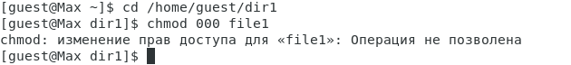{#fig:008 width=80% height=80%}

## Пункт 9

Снимем расширенный атрибут "a" с файла file1 от имени суперпользователя командой "chattr -a /home/guest/dir1/file1".

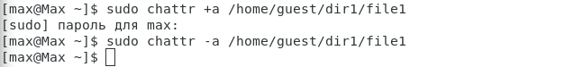{#fig:009 width=80% height=80%}

Повторим операции, которые ранее не удавалось выполнить. В первую очередь проверим что атрибут снят и мы можем менять уровень доступа к файлу. Теперь мы можем легко менять файл и проводить все взаимодействия.

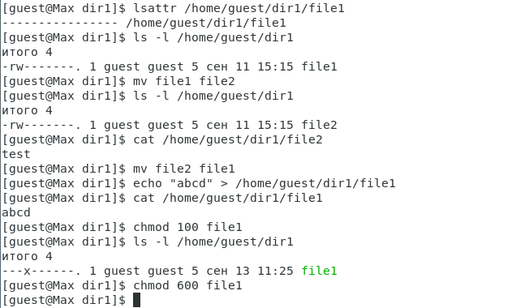{#fig:010 width=80% height=80%}

## Пункт 10

Повторите ваши действия по шагам, заменив атрибут «a» атрибутом «i» командой "chattr +i /home/guest/dir1/file1".

{#fig:011 width=80% height=80%}

Проверив результат работы всех ранее использованных команд снова можно заметить знавное изменения нельзя никак редактировать содержание файла file1 и менять его свойства и права.

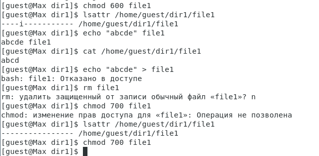{#fig:012 width=80% height=80%}

# Выводы

Получили практические навыкы работы в консоли с расширенными атрибутами файлов от имени разных пользователей, а также повысили свои навыки использования интерфейса командой строки и уровней доступа.

# Список литературы {.unnumbered}

1. [Основные команды для работы с Linux](https://eternalhost.net/blog/sozdanie-saytov/osnovnye-komandy-linux)
2. [Основы управления пользоателем и командой su](https://losst.pro/komanda-su-v-linux)
3. [Файл лабораторной работы](https://esystem.rudn.ru/pluginfile.php/2090277/mod_resource/content/3/004-lab_discret_extattr.pdf)
4. [Linux всё о правах доступа к файлам](https://itdid.ru/file_permissions.html)
