---
## Front matter
lang: ru-RU
title: "Лабораторная работа №5: Презентация."
subtitle: 
  Дискреционное разграничение прав в Linux. Исследование влияния дополнительных атрибутов.
author: 
    Евдокимов Максим Михайлович. Группа - НФИбд-01-20.\inst{1}
institute: 
    \inst{1}Российский Университет Дружбы Народов

date: 14 сентября, 2023, Москва, Россия

## i18n babel
babel-lang: russian
babel-otherlangs: english

## Formatting pdf
toc: false
toc-title: Содержание
slide_level: 2
aspectratio: 169
section-titles: true
theme: metropolis
header-includes:
 - \metroset{progressbar=frametitle,sectionpage=progressbar,numbering=fraction}
 - '\makeatletter'
 - '\beamer@ignorenonframefalse'
 - '\makeatother'
---

# Цели и задачи работы

## Цель лабораторной работы

Изучение механизмов изменения идентификаторов, применения SetUID- и Sticky-битов. Получение практических навыков работы в консоли с дополнительными атрибутами. Рассмотрение работы механизма смены идентификатора процессов пользователей, а также влияние бита Sticky на запись и удаление файлов.

## Задание

1. Изучить основы и особенности компилирование программ на Linux, работа с gcc, понятие объектный файл и другие.
2. Изучение механизмов изменения идентификаторов SetUID, SetGID и Sticky-битов.
3. Исследование Sticky-бита и рассмотрение его принципов работы в случае двух пользователей.

# Теория

## Подготовка лабораторного стенда

Командой "gcc -v" проверяем наличие gcc и если нет то используем команду "yum install gcc". Также чтобы менять атрибуты в системе уберём встроенную защиту от их изменений - SELinux, при помощи команды "setenforce 0". И проверив что она работает командой "getenforce", которая должна вывести: Permissive.

## Компилирование программ

Компиляторы, доступные в Linux-системах, являются частью коллекции GNU-компиляторов, известной как GCC (GNU Compiller Collection, подробнее см. http://gcc.gnu.org). В неё входят компиляторы языков С, С++, Java, Objective-C, Fortran и Chill. Будем использовать лишь первые два.

Так из наличие можно проверить двумя командами: "whereis gcc" и "whereis g++". Также в ходе работы будет создаваться - объектные файлы, которые невозможно запускать и использовать, поэтому после компиляции для получения готовой программы объектные файлы необходимо скомпоновать (автоудалить). Поэтому в ходе работы мы будем использовать команду "gcc ~файл~.c -o ~файл~" (где ~файл~ это имя файла кода с расширением .c), она не остовляет объектных файлов и даёт готовый к запуску файл.

# Выполнение лабораторной работы

## Пункт 1.0

Выполняем подготовку перед тем как начать работать, проверив наличие необходимых программ и их местоположение.

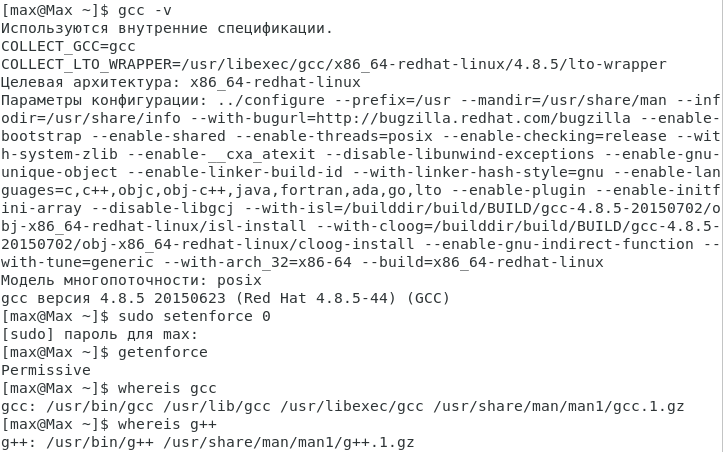{#fig:000 width=80% height=80%}

## Пункт 1.1

Войдим в систему от имени пользователя guest.

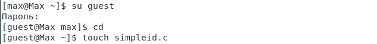{#fig:001 width=80% height=80%}

## Пункт 1.2

Создаём программу simpleid.c и вводим указанный код.

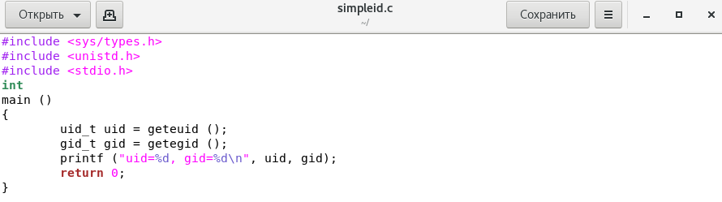{#fig:002 width=80% height=80%}

## Пункт 1.3

Скомплилируем программу командой "gcc simpleid.c -o simpleid" и убедимся, что файл программы создан просмотрев папку.

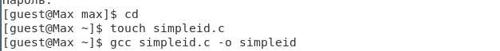{#fig:003 width=80% height=80%}

## Пункт 1.4

Выполните программу simpleid командой "./simpleid".

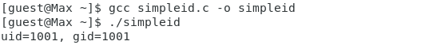{#fig:004 width=80% height=80%}

## Пункт 1.5

Выполним системную программу "id" и сравним полученный вами результат с данными предыдущего пункта
задания.

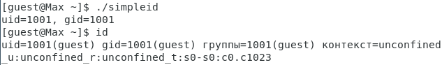{#fig:005 width=80% height=80%}

## Пункт 1.6

Усложняем программу, добавив вывод действительных идентификаторов. Для этого создадим новый файл командой "touch simpleid2.с".

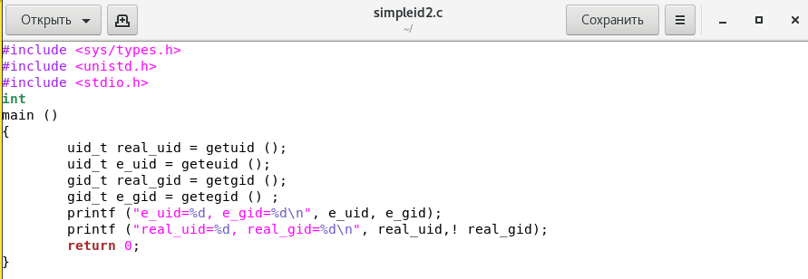{#fig:006 width=80% height=80%}

## Пункт 1.7

Скомпилируйте и запустите simpleid2.c командами "gcc simpleid2.c -o simpleid2" и "./simpleid2".

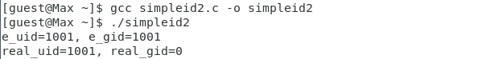{#fig:007 width=80% height=80%}

## Пункт 1.8

От имени суперпользователя выполним команды "sudo chown root:guest /home/guest/simpleid2" и "sudo chmod u+s /home/guest/simpleid2".

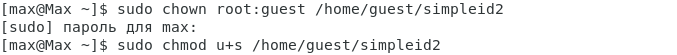{#fig:008 width=80% height=80%}

## Пункт 1.9

Используя sudo или повысив временно свои права с помощью su. Поясним, что делают эти команды.

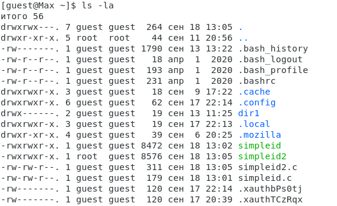{#fig:009 width=80% height=80%}

## Пункт 1.10

Выполним проверку правильности установки новых атрибутов и смены владельца файла simpleid2 командой "ls -l simpleid2".

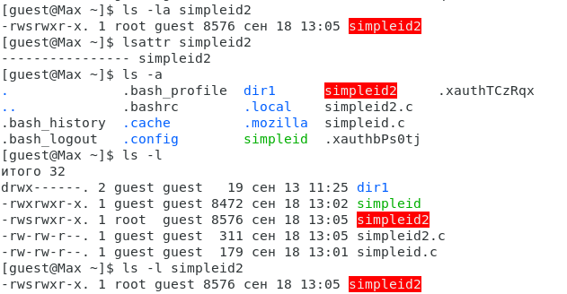{#fig:010 width=80% height=80%}

## Пункт 1.11

Запустим simpleid2 и id командами "./simpleid2" и "id". Сравним результаты.

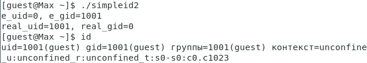{#fig:011 width=80% height=80%}

## Пункт 1.12

Проделаем тоже самое относительно SetGID-бита командой "sudo chmod g+s /home/guest/simpleid2".

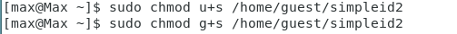{#fig:012 width=80% height=80%}

## Пункт 1.13

Создаём программу readfile.c.

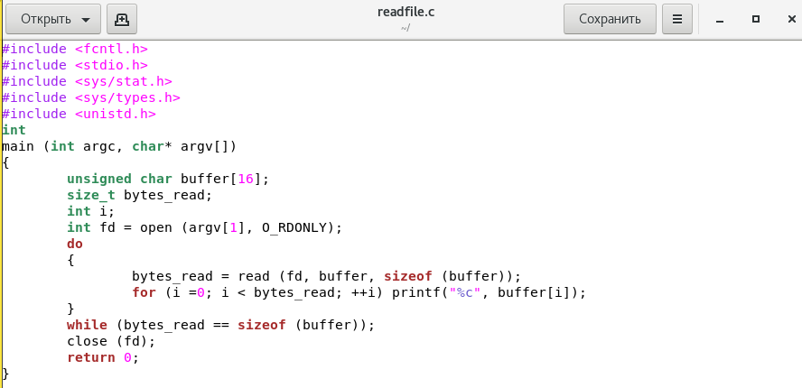{#fig:013 width=80% height=80%}

## Пункт 1.14

Откомпилируем код выше ранее используемыми командами.

{#fig:014 width=80% height=80%}

## Пункт 1.15

Сменим владельца у файла readfile.c (или любого другого текстового файла в системе) и изменим права так, чтобы только суперпользователь (root) мог прочитать его, a guest не мог. (выполнено не в полной мере)

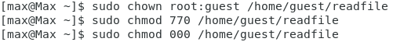{#fig:015 width=80% height=80%}

## Пункт 1.16

Проверим, что пользователь guest не может прочитать файл readfile.c.

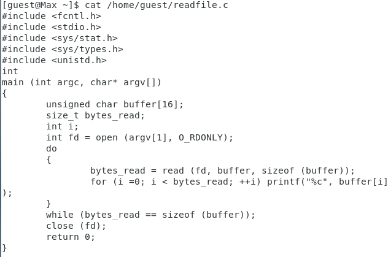{#fig:016 width=80% height=80%}

## Пункт 1.17

Сменим у программы readfile владельца и установите SetU’D-бит.

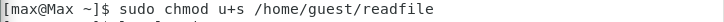{#fig:017 width=80% height=80%}

## Пункт 1.18

Проверим, может ли программа readfile прочитать файл readfile.c?

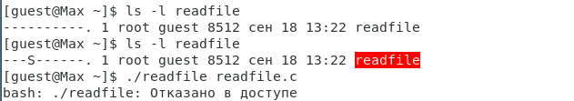{#fig:018 width=80% height=80%}

## Пункт 1.19

Проверим, может ли программа readfile прочитать файл /etc/shadow? Отразим полученный результат и ваши объяснения в отчёте

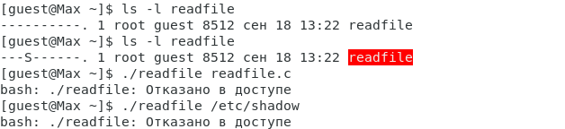{#fig:019 width=80% height=80%}

# Исследование Sticky-бита

## Пункт 2.1

Выясняем, установлен ли атрибут Sticky на директории /tmp, для чего выполните команду "ls -l / | grep tmp".

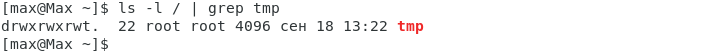{#fig:020 width=80% height=80%}

## Пункт 2.2

От имени пользователя guest создим файл file01.txt в директории /tmp со словом test командой "echo "test" > /tmp/file01.txt".

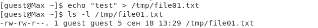{#fig:021 width=80% height=80%}

## Пункт 2.3

Просмотрите атрибуты у только что созданного файла и разрешите чтение и запись для категории пользователей «все остальные» команды "ls -l /tmp/file01.txt", "chmod o+rw /tmp/file01.txt" и "ls -l /tmp/file01.txt".

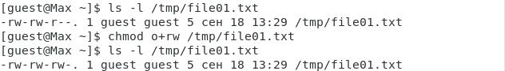{#fig:022 width=80% height=80%}

## Пункт 2.4

От пользователя guest2 (не являющегося владельцем) попробуем прочитать файл командой "cat /tmp/file01.txt".

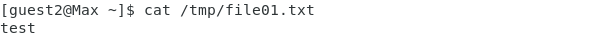{#fig:023 width=80% height=80%}

## Пункт 2.5

От пользователя guest2 дозаписываем в файл /tmp/file01.txt слово test2 командой "echo "test2" > /tmp/file01.txt". Что проходит успешно.

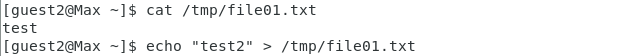{#fig:024 width=80% height=80%}

## Пункт 2.6

Проверим содержимое файла командой "cat /tmp/file01.txt".

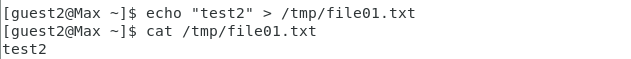{#fig:025 width=80% height=80%}

## Пункт 2.7

От пользователя guest2 попробуйте записать в файл /tmp/file01.txt слово test3, стерев при этом всю имеющуюся в файле информацию командой "echo "test3" > /tmp/file01.txt".

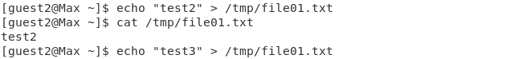{#fig:026 width=80% height=80%}

## Пункт 2.8

Проверим содержимое файла командой "cat /tmp/file01.txt".

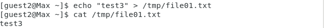{#fig:027 width=80% height=80%}

## Пункт 2.9

От пользователя guest2 попробуем удалить файл /tmp/file01.txt командой "rm /tmp/fileOl.txt".

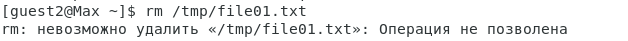{#fig:028 width=80% height=80%}

## Пункт 2.10

Повысим свои права до суперпользователя командой "su -" и выполните после этого команду, снимающую атрибут t (Sticky-бит) "chmod -t /tmp".

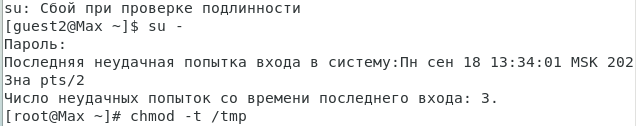{#fig:029 width=80% height=80%}

## Пункт 2.11

Покиньте режим суперпользователя командой "exit".

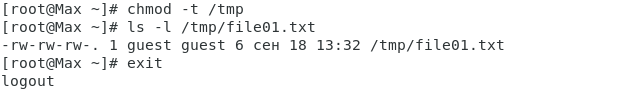{#fig:030 width=80% height=80%}

## Пункт 2.12

От пользователя guest2 проверим, что атрибута t у директории /tmp нет: "ls -l / | grep tmp".

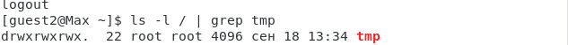{#fig:031 width=80% height=80%}

## Пункт 2.13

Повторив предыдущие шаги, можем заметить что мы теперь можем взаимодействовать с файлом как раньше и способны его удалить.

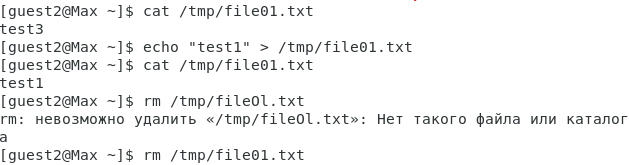{#fig:032 width=80% height=80%}

## Пункт 2.14

Удалось удалить файл от имени пользователя, не являющегося его владельцем.

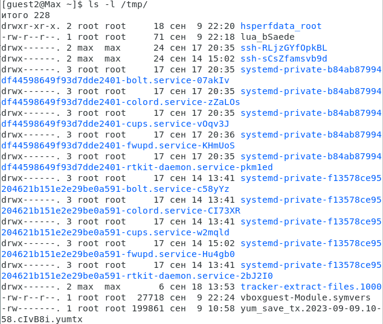{#fig:033 width=80% height=80%}

## Пункт 2.15

Повысим свои права до суперпользователя и вернём атрибут t на директорию выполнив цепочку команд "su -", "chmod +t /tmp" и "exit".

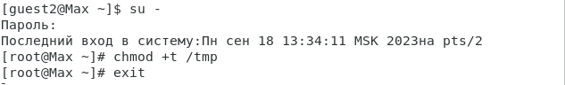{#fig:034 width=80% height=80%}

# Выводы по проделанной работе

## Вывод

Изучены механизмы изменения идентификаторов UID, GID и Sticky-битов. Получены практическе навыки работы в консоли с дополнительными атрибутами. Рассмотрены работы механизма смены идентификатора процессов пользователей, а также влияние бита Sticky на запись и удаление файлов.
