---
## Front matter
lang: ru-RU
title: "Лабораторная работа №6: отчет."
subtitle: "Мандатное разграничение прав в Linux."
author: "Евдокимов Максим Михайлович. Группа - НФИбд-01-20."

## Generic otions
lang: ru-RU
toc-title: "Содержание"

## Bibliography
bibliography: bib/cite.bib
csl: pandoc/csl/gost-r-7-0-5-2008-numeric.csl

## Pdf output format
toc: true # Table of contents
toc-depth: 2
lof: true # List of figures
fontsize: 12pt
linestretch: 1.5
papersize: a4
documentclass: scrreprt
## I18n polyglossia
polyglossia-lang:
  name: russian
  options:
	- spelling=modern
	- babelshorthands=true
polyglossia-otherlangs:
  name: english
## I18n babel
babel-lang: russian
babel-otherlangs: english
## Fonts
mainfont: PT Serif
romanfont: PT Serif
sansfont: PT Sans
monofont: PT Mono
mainfontoptions: Ligatures=TeX
romanfontoptions: Ligatures=TeX
sansfontoptions: Ligatures=TeX,Scale=MatchLowercase
monofontoptions: Scale=MatchLowercase,Scale=0.9
## Biblatex
biblatex: true
biblio-style: "gost-numeric"
biblatexoptions:
  - parentracker=true
  - backend=biber
  - hyperref=auto
  - language=auto
  - autolang=other*
  - citestyle=gost-numeric
## Pandoc-crossref LaTeX customization
figureTitle: "Рис."
listingTitle: "Листинг"
lofTitle: "Список иллюстраций"
lotTitle: "Список таблиц"
lolTitle: "Листинги"
## Misc options
indent: true
header-includes:
  - \usepackage{indentfirst}
  - \usepackage{float} # keep figures where there are in the text
  - \floatplacement{figure}{H} # keep figures where there are in the text
---

# Цель работы

Развить навыки администрирования ОС Linux. Получить первое практическое знакомство с технологией SELinux1.
Проверить работу SELinx на практике совместно с веб-сервером Apache.

# Задание

1. Истоновить Apache и настроить его и систему для работы.
2. Изучить основы упровления и создания локалных сайтов.
3. Изучить основы SELinux и его работы совместно с веб-сервером Apache.

# Подготовка

## Пункт 1

Для проведения указанной лабораторной работы на одно рабочее место требуется компьютер с установленной операционной системой Linux,
поддерживающей технологию SELinux. А также иметь устоновленный пакет Apache или его аналог httpd.

## Пункт 2

При необходимости администратор должен разбираться в работе SELinux и уметь как исправить конфигурационный файл /etc/selinux/config, так и проверить используемый режим и политику.

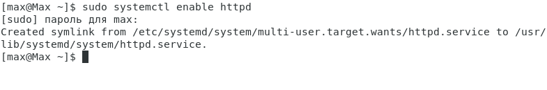{#fig:001 width=80% height=80%}

В конфигурационном файле /etc/httpd/httpd.conf необходимо задать параметр ServerName "test.ru" чтобы при запуске веб-сервера не выдавались лишние сообщения об ошибках, не относящихся к лабораторной работе.

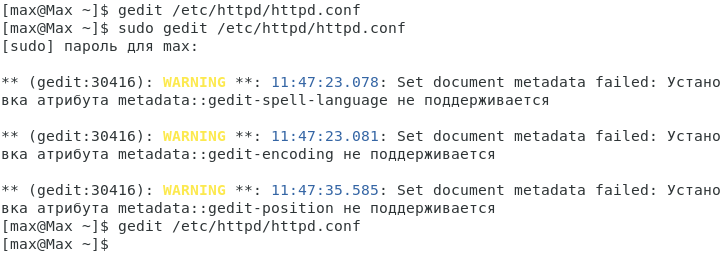{#fig:002 width=80% height=80%}

Также необходимо проследить, чтобы пакетный фильтр был отключён или в своей рабочей конфигурации позволял подключаться к 80-у и 81-у портам протокола tcp.

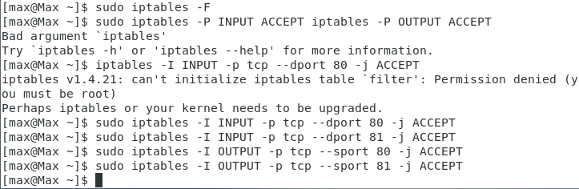{#fig:003 width=80% height=80%}

# Выполнение лабораторной работы

## Пункт 1

Воходим в систему с полученными учётными данными и убеждаемся, что SELinux работает в режиме enforcing политики targeted с помощью команд "getenforce" и "sestatus".

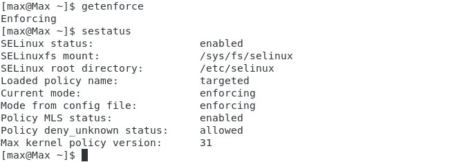{#fig:004 width=80% height=80%}

## Пункт 2

Обратимся с помощью браузера к веб-серверу, запущенному на вашем компьютере, и убедитесь, что последний работает "service httpd status".

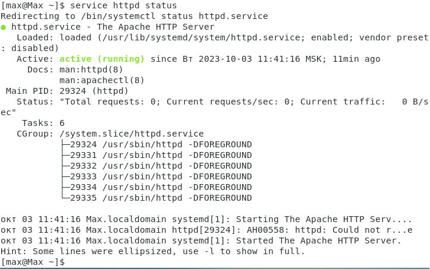{#fig:005 width=80% height=80%}

## Пункт 3

Найдём веб-сервер Apache в списке процессов, определите его контекст безопасности и занесите эту информацию в отчёт. Например, можно использовать команду
"ps -eZ | grep httpd"

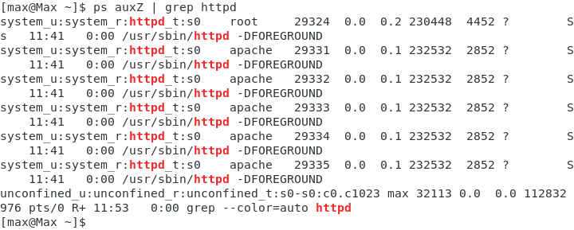{#fig:006 width=80% height=80%}

## Пункт 4

Посмотрим текущее состояние переключателей SELinux для Apache с помощью команды "sestatus -bigrep httpd".

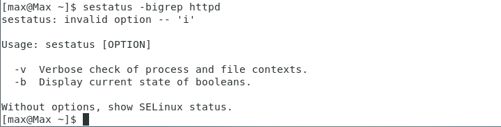{#fig:007 width=80% height=80%}

## Пункт 5

Посмотрим статистику по политике с помощью команды seinfo, такжеопределите множество пользователей, ролей, типов.

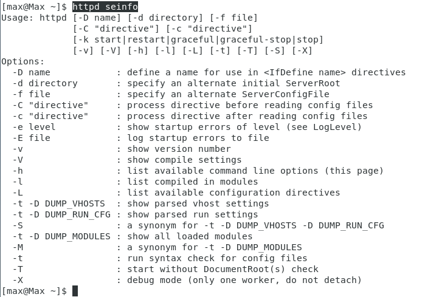{#fig:008 width=80% height=80%}

## Пункт 6

Определим тип файлов и поддиректорий, находящихся в директории /var/www, с помощью команды "ls -lZ /var/www".

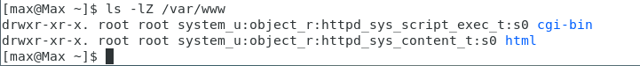{#fig:009 width=80% height=80%}

## Пункт 7

Определим тип файлов, находящихся в директории /var/www/html командой "ls -lZ /var/www/html".

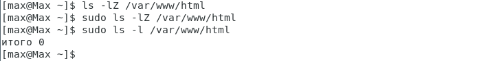{#fig:010 width=80% height=80%}

## Пункт 8

Определим круг пользователей, которым разрешено создание файлов в директории /var/www/html командой "ls -al /var/www/html".

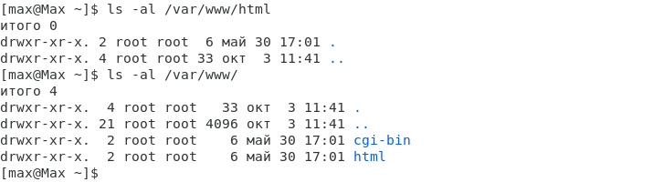{#fig:011 width=80% height=80%}

## Пункт 9

Создаём от имени суперпользователя (так как в дистрибутиве после установки только ему разрешена запись в директорию) html-файл
/var/www/html/test.html следующего содержания:
<html>
  <body>test</body>
</html>

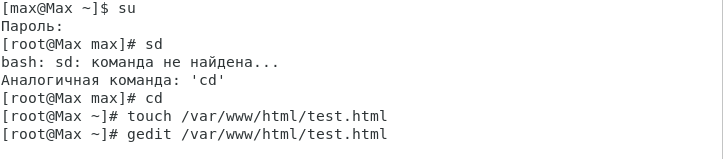{#fig:012 width=80% height=80%}

## Пункт 10

Проверим контекст созданного вами файла. Занесите в отчёт контекст, присваиваемый по умолчанию вновь созданным файлам в директории /var/www/html.

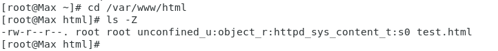{#fig:013 width=80% height=80%}

## Пункт 11

Обратимся к файлу через веб-сервер, введя в браузере адрес "http://127.0.0.1/test.html". Убедимся, что файл был успешно отображён.

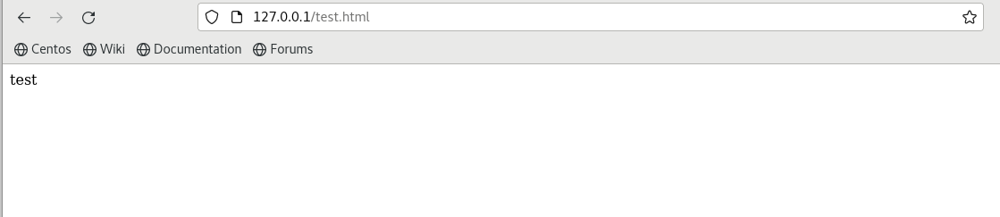{#fig:014 width=80% height=80%}

## Пункт 12

Изучем справку "man httpd_selinux" и выясните, какие контексты файлов определены для httpd. Сопоставьте их с типом файла test.html, проверив контекст файла можно командой "ls -Z /var/www/html/test.html".

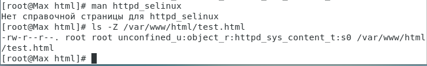{#fig:015 width=80% height=80%}

## Пункт 13

Измените контекст файла /var/www/html/test.html с httpd_sys_content_t на любой другой, к которому процесс httpd не должен иметь доступа, например, на samba_share_t командами "chcon -t samba_share_t /var/www/html/test.html" и "ls -Z /var/www/html/test.html".

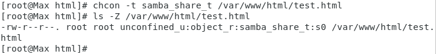{#fig:016 width=80% height=80%}

## Пункт 14

Попробуем ещё раз получить доступ к файлу через веб-сервер, введя в браузере адрес "http://127.0.0.1/test.html". И получаем сообщение об ошибке Forbidden.

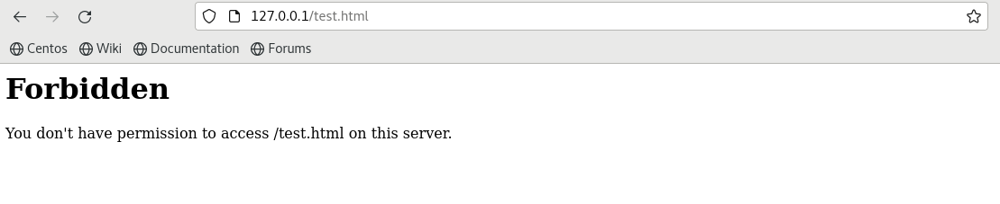{#fig:017 width=80% height=80%}

## Пункт 15

Проанализируем ситуацию. Почему файл не был отображён, если права доступа позволяют читать этот файл любому пользователю? "ls -l /var/www/html/test.html".
Просмотрим log-файлы веб-сервера Apache. Также просмотрите системный лог-файл: "tail /var/log/messages".

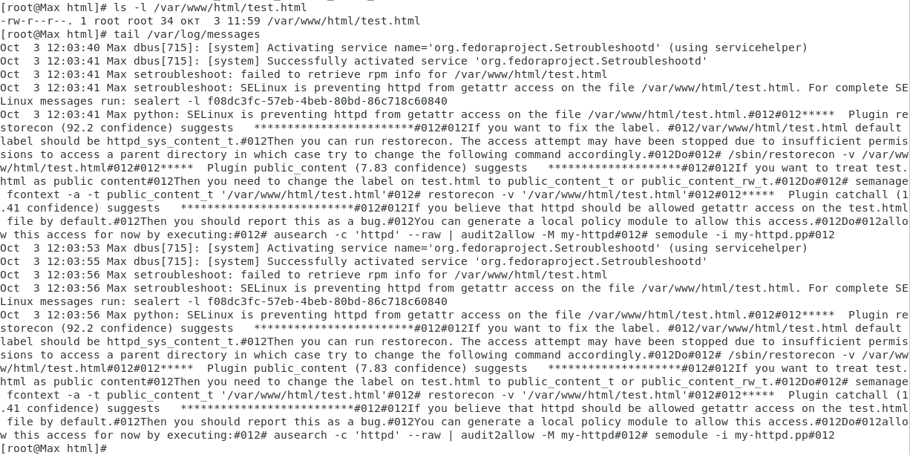{#fig:018 width=80% height=80%}

## Пункт 16

Запустим веб-сервер Apache на прослушивание ТСР-порта 81 (а не 80, как рекомендует IANA и прописано в /etc/services). Для этого в файле /etc/httpd/httpd.conf найдите строчку Listen 80 и замените её на Listen 81.

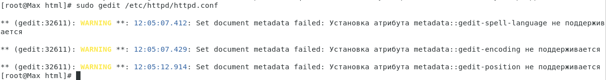{#fig:019 width=80% height=80%}

## Пункт 17

Выполнив перезапуск веб-сервера Apache.

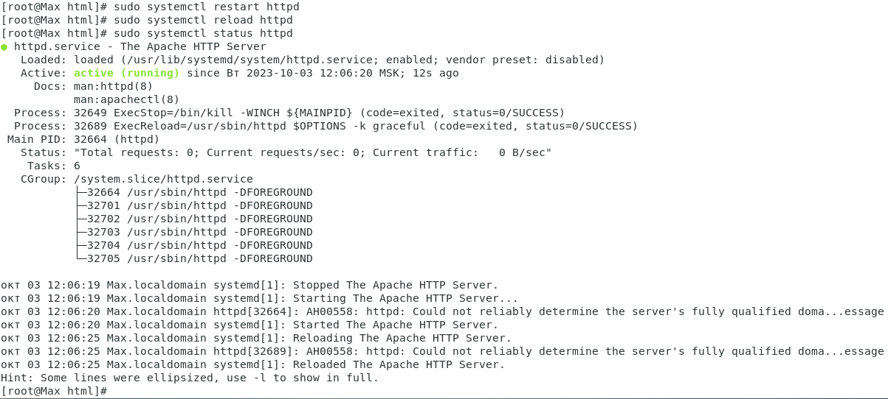{#fig:020 width=80% height=80%}

## Пункт 18

Проанализируем лог-файлы командой "tail -nl /var/log/messages". Также просмотрим файлы /var/log/http/error_log, /var/log/http/access_log и /var/log/audit/audit.log и выясните, в каких файлах появились записи.

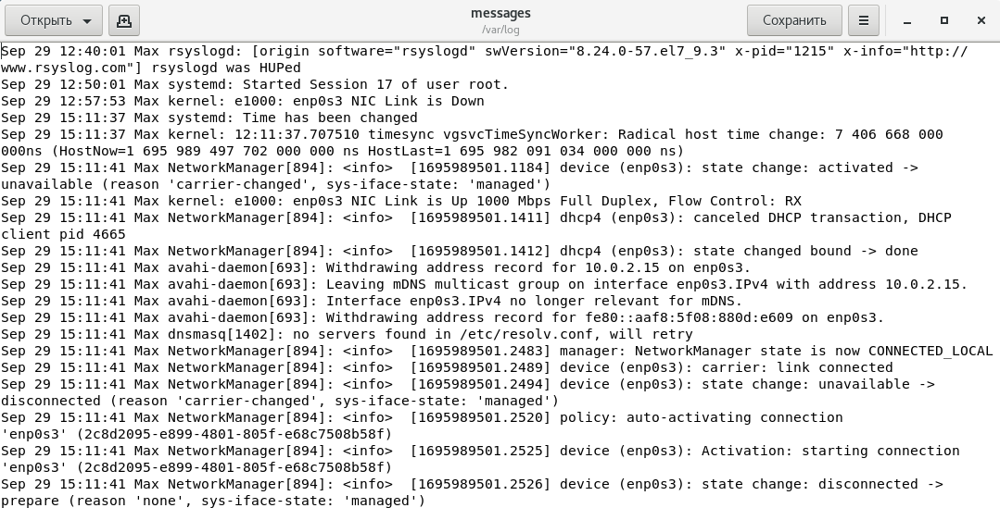{#fig:021 width=80% height=80%}

## Пункт 19

Выполните команду "semanage port -a -t http_port_t -р tcp 81". После этого проверьте список портов командой "semanage port -l | grep http_port_t".
Убедимся, что порт 81 появился в списке.

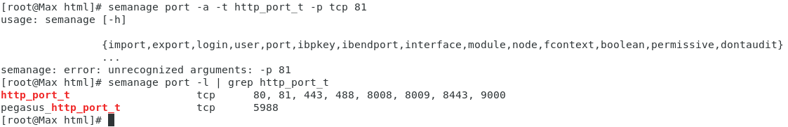{#fig:022 width=80% height=80%}

## Пункт 20

Пробуем запустить веб-сервер Apache ещё раз. И он работает.

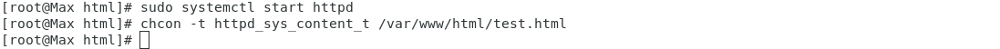{#fig:023 width=80% height=80%}

## Пункт 21

Вернём контекст httpd_sys_cоntent__t к файлу /var/www/html/ test.html: "chcon -t httpd_sys_content_t /var/www/html/test.html".
После этого попробуем получить доступ к файлу через веб-сервер, введя в браузере адрес http://127.0.0.1:81/test.html.

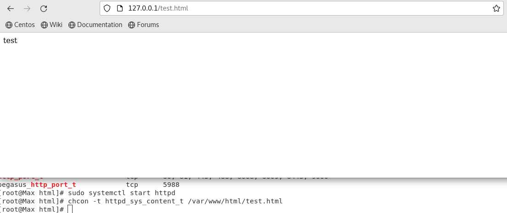{#fig:024 width=80% height=80%}

## Пункт 22

Исправим обратно конфигурационный файл apache, вернув Listen 80.

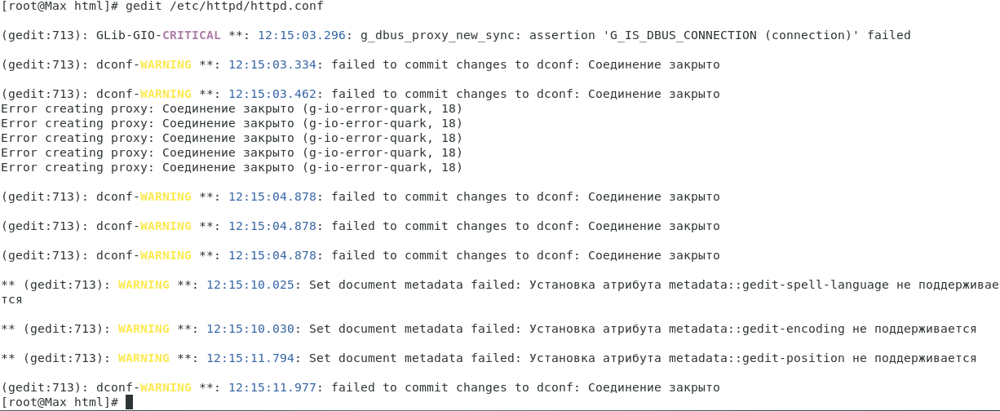{#fig:025 width=80% height=80%}

## Пункт 23

Удалите привязку http_port_t к 81 порту: "semanage port -d -t http_port_t -p tcp 81" и проверьте, что порт 81 удалён.

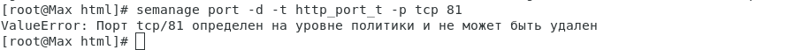{#fig:026 width=80% height=80%}

## Пункт 24

Удалим файл /var/www/html/test.html командой "rm /var/www/html/test.html".

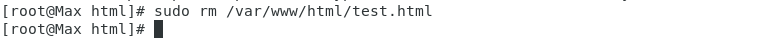{#fig:027 width=80% height=80%}

# Выводы

В ходе работы был изучен пакет httpd (аналог apache), а также основы по работе с ним и с SELinux.

# Список литературы {.unnumbered}

1. [Лабораторная №6](https://esystem.rudn.ru/pluginfile.php/2090282/mod_resource/content/2/006-lab_selinux.pdf)
2. [Основы работы с SELinux](https://habr.com/ru/companies/otus/articles/460387/)
3. [Информация о работе с пакетными менеджерами](https://distroid.net/fix-apt-command-error-linux/)
4. [Устоновка Apache на CentOS через yum](https://www.digitalocean.com/community/tutorials/how-to-install-the-apache-web-server-on-centos-7-ru)
5. [Работа с Apache/httpd](https://routerus.com/start-stop-restart-apache/)
